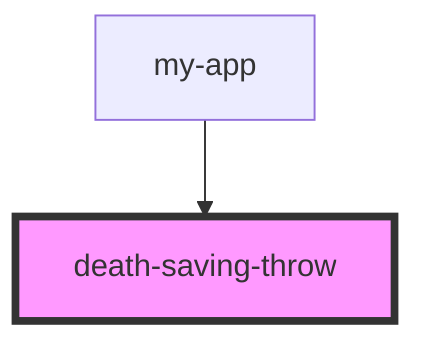

# death-saving-throw

<!-- Auto Generated Below -->

## Properties

| Property       | Attribute       | Description | Type     | Default |
| -------------- | --------------- | ----------- | -------- | ------- |
| `maxFailures`  | `max-failures`  |             | `number` | `3`     |
| `maxSuccesses` | `max-successes` |             | `number` | `3`     |

## Methods

### `clearCounts() => Promise<void>`

#### Returns

Type: `Promise<void>`

## Dependencies

### Used by

 - [my-app](../../my-app)

### Graph

----------------------------------------------

*Built with [StencilJS](https://stenciljs.com/)*
