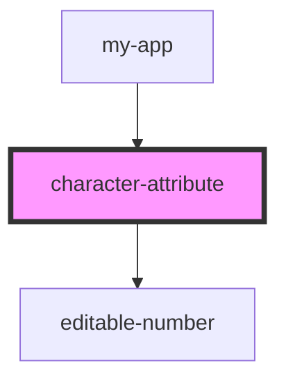

# character-attribute

<!-- Auto Generated Below -->

## Properties

| Property           | Attribute         | Description | Type       | Default      |
| ------------------ | ----------------- | ----------- | ---------- | ------------ |
| `attributeCap`     | `attribute-cap`   |             | `number`   | `undefined`  |
| `attributeValue`   | `attribute-value` |             | `number`   | `undefined`  |
| `bonusCalculation` | --                |             | `Function` | `undefined`  |
| `name`             | `name`            |             | `string`   | `undefined`  |
| `showBonus`        | `show-bonus`      |             | `boolean`  | `true`       |
| `styleType`        | `style-type`      |             | `string`   | `'vertical'` |

## Dependencies

### Used by

 - [my-app](../../my-app)

### Depends on

- [editable-number](../../common/editable-number)

### Graph

----------------------------------------------

*Built with [StencilJS](https://stenciljs.com/)*
