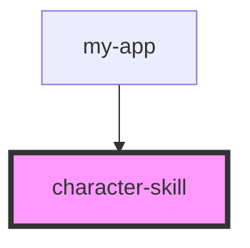

# character-skill

<!-- Auto Generated Below -->

## Properties

| Property           | Attribute           | Description | Type      | Default     |
| ------------------ | ------------------- | ----------- | --------- | ----------- |
| `attributeBonus`   | `attribute-bonus`   |             | `number`  | `0`         |
| `bonus`            | `bonus`             |             | `number`  | `0`         |
| `name`             | `name`              |             | `string`  | `undefined` |
| `proficiencyBonus` | `proficiency-bonus` |             | `number`  | `2`         |
| `proficient`       | `proficient`        |             | `boolean` | `undefined` |
| `ranks`            | `ranks`             |             | `number`  | `0`         |

## Dependencies

### Used by

 - [my-app](../../my-app)

### Graph

----------------------------------------------

*Built with [StencilJS](https://stenciljs.com/)*
