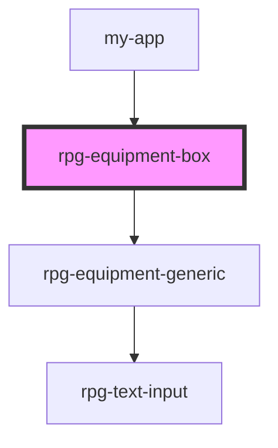

# rpg-equipment-box

<!-- Auto Generated Below -->

## Properties

| Property     | Attribute     | Description | Type     | Default |
| ------------ | ------------- | ----------- | -------- | ------- |
| `numGeneric` | `num-generic` |             | `number` | `10`    |
| `numWeapons` | `num-weapons` |             | `number` | `3`     |

## Dependencies

### Used by

 - [my-app](../../../my-app)

### Depends on

- [rpg-equipment-generic](../generic)

### Graph

----------------------------------------------

*Built with [StencilJS](https://stenciljs.com/)*
