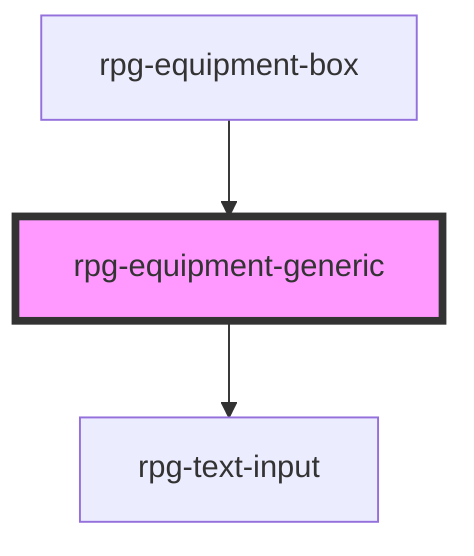

# rpg-equipment-generic

<!-- Auto Generated Below -->

## Properties

| Property        | Attribute        | Description | Type     | Default     |
| --------------- | ---------------- | ----------- | -------- | ----------- |
| `name`          | `name`           |             | `string` | `''`        |
| `size`          | `size`           |             | `string` | `undefined` |
| `startingCount` | `starting-count` |             | `number` | `0`         |
| `weight`        | `weight`         |             | `number` | `0`         |

## Methods

### `useItem() => Promise<boolean>`

#### Returns

Type: `Promise<boolean>`

## Dependencies

### Used by

 - [rpg-equipment-box](../box)

### Depends on

- [rpg-text-input](../../../common/text-input)

### Graph

----------------------------------------------

*Built with [StencilJS](https://stenciljs.com/)*
