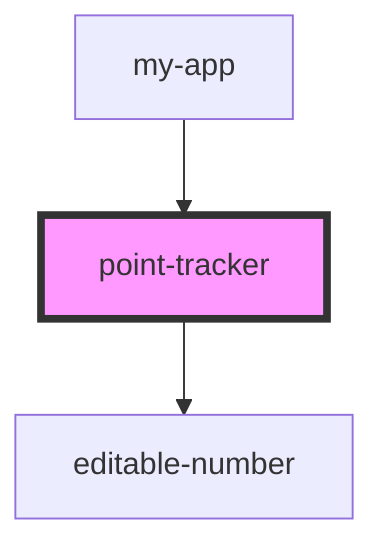

# point-tracker

<!-- Auto Generated Below -->

## Properties

| Property           | Attribute           | Description | Type      | Default     |
| ------------------ | ------------------- | ----------- | --------- | ----------- |
| `maximum`          | `maximum`           |             | `number`  | `undefined` |
| `minimum`          | `minimum`           |             | `number`  | `0`         |
| `pointTitle`       | `point-title`       |             | `string`  | `undefined` |
| `showIncrementors` | `show-incrementors` |             | `boolean` | `true`      |

## Dependencies

### Used by

 - [my-app](../../my-app)

### Depends on

- [editable-number](../../common/editable-number)

### Graph

----------------------------------------------

*Built with [StencilJS](https://stenciljs.com/)*
