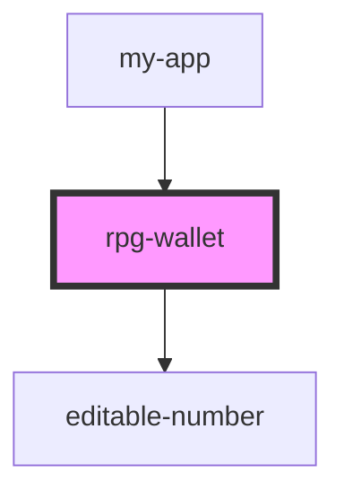

# rpg-wallet

<!-- Auto Generated Below -->

## Properties

| Property         | Attribute | Description                                           | Type       | Default                                                   |
| ---------------- | --------- | ----------------------------------------------------- | ---------- | --------------------------------------------------------- |
| `currencies`     | --        | This is maintained in 2 values to preserve the order. | `string[]` | `[     'GP',     'SP',     'PP',     'EP',     'CP',   ]` |
| `currencyValues` | --        |                                                       | `number[]` | `[     0,     0,     0,     0,     0   ]`                 |

## Methods

### `setCurrencyValue(nameOrIndex: any, value: any) => Promise<any>`

#### Returns

Type: `Promise<any>`

## Dependencies

### Used by

 - [my-app](../../my-app)

### Depends on

- [editable-number](../../common/editable-number)

### Graph

----------------------------------------------

*Built with [StencilJS](https://stenciljs.com/)*
