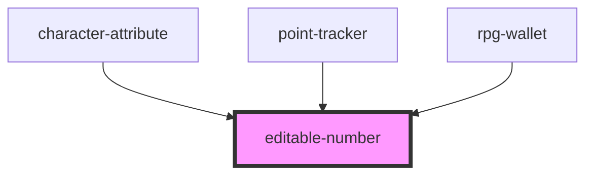

# editable-number

<!-- Auto Generated Below -->

## Properties

| Property        | Attribute        | Description | Type     | Default     |
| --------------- | ---------------- | ----------- | -------- | ----------- |
| `startingValue` | `starting-value` |             | `number` | `undefined` |

## Events

| Event          | Description | Type               |
| -------------- | ----------- | ------------------ |
| `valueChanged` |             | `CustomEvent<any>` |

## Dependencies

### Used by

 - [character-attribute](../../character-sheet/character-attribute)
 - [point-tracker](../../character-sheet/point-tracker)
 - [rpg-wallet](../../character-sheet/wallet)

### Graph

----------------------------------------------

*Built with [StencilJS](https://stenciljs.com/)*
