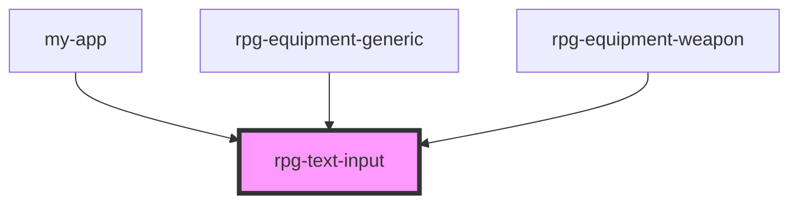

# rpg-text-input

<!-- Auto Generated Below -->

## Properties

| Property       | Attribute       | Description | Type      | Default     |
| -------------- | --------------- | ----------- | --------- | ----------- |
| `isEditable`   | `is-editable`   |             | `boolean` | `true`      |
| `label`        | `label`         |             | `string`  | `undefined` |
| `placeholder`  | `placeholder`   |             | `string`  | `undefined` |
| `showLock`     | `show-lock`     |             | `boolean` | `true`      |
| `startingText` | `starting-text` |             | `string`  | `undefined` |
| `styleType`    | `style-type`    |             | `string`  | `'inline'`  |

## Dependencies

### Used by

 - [my-app](../../my-app)
 - [rpg-equipment-generic](../../character-sheet/equipment/generic)
 - [rpg-equipment-weapon](../../character-sheet/equipment/weapon)

### Graph

----------------------------------------------

*Built with [StencilJS](https://stenciljs.com/)*
