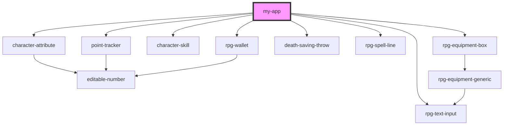

# my-app

<!-- Auto Generated Below -->

## Dependencies

### Depends on

- [rpg-text-input](../common/text-input)
- [character-attribute](../character-sheet/character-attribute)
- [point-tracker](../character-sheet/point-tracker)
- [character-skill](../character-sheet/character-skill)
- [rpg-wallet](../character-sheet/wallet)
- [death-saving-throw](../5e/death-saving-throw)
- [rpg-spell-line](../pathfinder-2e/spell-line)
- [rpg-equipment-box](../character-sheet/equipment/box)

### Graph

----------------------------------------------

*Built with [StencilJS](https://stenciljs.com/)*
