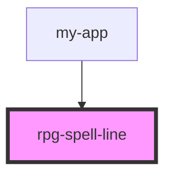

# rpg-spell-line

<!-- Auto Generated Below -->

## Properties

| Property     | Attribute    | Description | Type       | Default                                              |
| ------------ | ------------ | ----------- | ---------- | ---------------------------------------------------- |
| `components` | --           |             | `string[]` | `[     'verbal',     'somatic',     'material',   ]` |
| `spellName`  | `spell-name` |             | `string`   | `undefined`                                          |

## Events

| Event          | Description | Type               |
| -------------- | ----------- | ------------------ |
| `didCastSpell` |             | `CustomEvent<any>` |

## Methods

### `castSpell() => Promise<any>`

#### Returns

Type: `Promise<any>`

## Dependencies

### Used by

 - [my-app](../../my-app)

### Graph

----------------------------------------------

*Built with [StencilJS](https://stenciljs.com/)*
